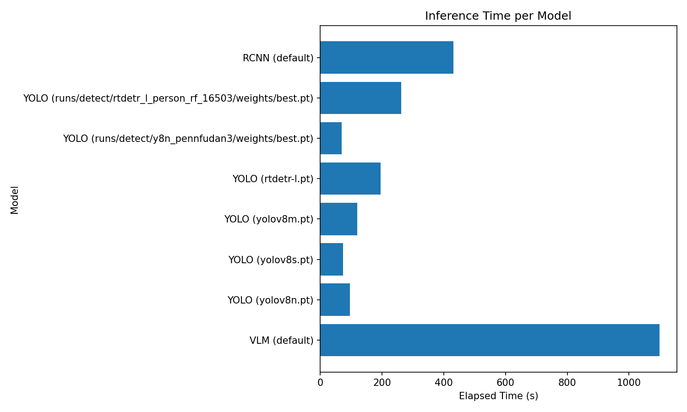
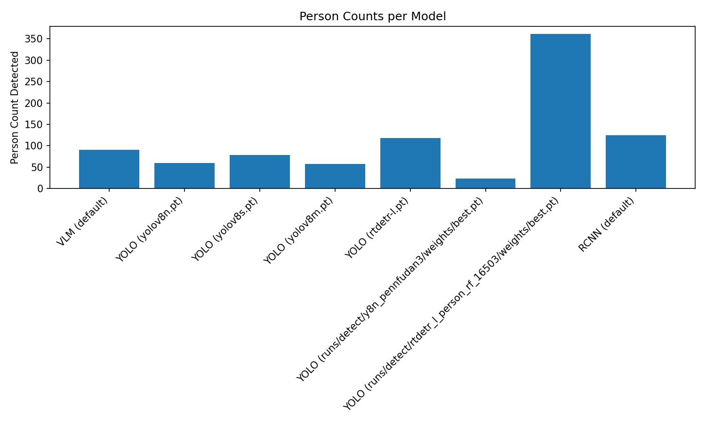
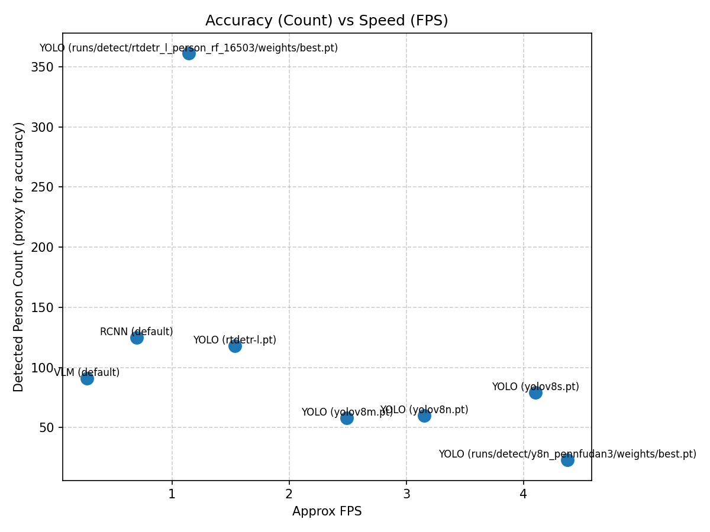

# Virtual Fence: Person Detection, Tracking, and Counting  

This repository implements a **Virtual Fence system** to detect, track, and count people crossing predefined regions in video streams.  

We evaluate and compare **three major approaches**:  
- **YOLO (You Only Look Once)** – fast real-time detection.  
- **Faster R-CNN (ResNet50-FPN v2)** – high accuracy, strong region proposals.  
- **Vision-Language Model (VLM, OWLv2)** – prompt-based open-vocabulary detection.  

The system supports:  
✔️ **Data preprocessing**  
✔️ **Training & fine-tuning**  
✔️ **Inference on videos**  
✔️ **Counting across zones**  
✔️ **Benchmarking & visualization**  
✔️ **ONNX export for deployment**  

---

## 📂 Repository Structure  

```
virtual-fence/
│
├── datasets/                      # Datasets
│   ├── person_rf/                 # Roboflow COCO Person-only dataset
│   ├── penn_fudan/                # Penn-Fudan pedestrian dataset
│   └── custom/                    # Custom collected dataset
│
├── virtual_fence/                 # Main package
│   ├── detectors/                 # YOLO, Faster R-CNN, VLM classes
│   ├── trackers/                  # SORT tracker
│   └──  utils/                     # Helpers 
│
├── scripts/                       # Entry points
│   ├── inference.py               # Run inference
│   ├── benchmark.py               # Run benchmark
│   ├── train.py                   # Training/fine-tuning
│   ├── export_yolo_onnx.py             # ONNX export
│   ├── eval_ap50.py
│   ├── inference_onnx.py
│   ├── convert_penndufan.py
│   └── spilt_yolo_dataset.py
│
├── configs/                       # Dataset/hyperparameter configs
├── outputs/                       # Output videos & benchmark logs
├── runs/                          # training proccess and weights  
├── requirements.txt
├── README.md
└── LICENSE
```

---

## 🗂️ Datasets  

### 1. COCO Person-Only Dataset (Roboflow)  
Download from: [Roboflow COCO Person Dataset](https://universe.roboflow.com/computer-vision-6lifs/coco-dataset-limited--person-only-hrvsw)  

Extract into:  
```
datasets/person_rf/
│── images/
│   ├── train/
│   ├── val/
│   └── test/
│── labels/
│── person.yaml
```

### 2. Penn-Fudan Pedestrian Dataset  
Download from: [Penn-Fudan Dataset](https://www.cis.upenn.edu/~jshi/ped_html/)  

Extract into:  
```
datasets/penn_fudan/
│── PNGImages/         # Raw images
│── PedMasks/          # Segmentation masks
│── Annotations/       # Bounding box annotations
```

### 3. Custom Dataset  
Collected from video recordings and annotated with **LabelImg**.  

Structure:  
```
datasets/custom/
│── images/
│   ├── train/
│   ├── val/
│── labels/
│── custom.yaml
```

---

## ▶️ Inference  

```bash
python -m scripts.inference     --input input.mp4     --output outputs/yolo.mp4     --zone 200,100,700,500     --detector yolo     --tracker sort     --weights yolov8n.pt
```

Arguments:  
- `--input`: Input video file.  
- `--output`: Output path.  
- `--zone`: Virtual fence zone (x1,y1,x2,y2).  
- `--detector`: `yolo`, `rcnn`, `vlm`.  
- `--tracker`: Tracker type (e.g., `sort`).  
- `--weights`: Model weights file.  

---

## 🏋️ Training  

### YOLO / RT-DETR  
```bash
yolo detect train     model=rtdetr-l.pt     data=datasets/person_rf/person.yaml     epochs=80     imgsz=1280     batch=8     workers=0     device=0     name=rtdetr_l_person_rf
```

### Faster R-CNN  
```bash
python -m scripts.train     --detector rcnn     --dataset datasets/person_rf/person.yaml     --epochs 50     --batch-size 4
```

---

## 📦 ONNX Export  

- YOLO:
  ```bash
  yolo export model=yolov8s.pt format=onnx
  ```

- Faster R-CNN:
  ```bash
  python -m scripts.export_onnx --detector rcnn --weights model.pth --output rcnn.onnx
  ```

ONNX allows deployment to TensorRT, OpenVINO, or ONNXRuntime.  

---

## 📈 Benchmarking  

```bash
python -m scripts.benchmark --detectors yolo rcnn vlm     --weights yolov8n.pt yolov8s.pt yolov8m.pt rtdetr-l.pt
```

---

## 📊 Benchmark Results  

| Detector | Weights | Time (s) | Count | Output Video |
|----------|---------|----------|-------|--------------|
| VLM | default | 1099.5 | 91 | outputs\bench\vlm.mp4 |
| YOLO | yolov8n.pt | 95.2 | 60 | outputs\bench\yolo-yolov8n-1efd56.mp4 |
| YOLO | yolov8s.pt | 73.1 | 79 | outputs\bench\yolo-yolov8s-1b1b99.mp4 |
| YOLO | yolov8m.pt | 120.3 | 58 | outputs\bench\yolo-yolov8m-db76f6.mp4 |
| YOLO | rtdetr-l.pt | 195.3 | 118 | outputs\bench\yolo-rtdetr-l-e1f79e.mp4 |
| YOLO | runs/detect/y8n_pennfudan3/weights/best.pt | 68.5 | 23 | outputs\bench\yolo-best-25ae78.mp4 |
| YOLO | runs/detect/rtdetr_l_person_rf_16503/weights/best.pt | 262.3 | 361 | outputs\bench\yolo-best-f3c1ea.mp4 |
| RCNN | default | 430.5 | 125 | outputs\bench\rcnn.mp4 |


### Visualizations  

**1. Inference Time per Model**  
  

**2. Person Count Comparison**  
  

**3. Accuracy vs Speed (approximation)**  
  

---

## ⚖️ Why These Models?  

- **YOLO** was chosen for real-time deployment.  
- **Faster R-CNN** was chosen for high accuracy (uses Region Proposal Networks).  
- **VLM (OWLv2)** was chosen for open-vocabulary, prompt-based detection.  

---

## ⚙️ Configuration Files

The `configs/` directory contains YAML configuration files used by training scripts.

- **configs/dataset_yolo.yaml**  
  Dataset definition for YOLO training.  
  Specifies training/validation paths and the single class `person`.  
  **Usage:**
  ```bash
  python scripts/train_yolo.py --data configs/dataset_yolo.yaml --epochs 50 --weights yolov8n.pt
  ```

- **configs/hyp_person.yaml**  
  Hyperparameters for YOLO training, including augmentation, learning rate, momentum, warmup, etc.  
  **Usage (override default hyperparameters):**
  ```bash
  python scripts/train_yolo.py --data configs/dataset_yolo.yaml --hyp configs/hyp_person.yaml
  ```

- **configs/person.yaml**  
  Alternative dataset config (YOLO/RT-DETR style) pointing to train/val/test folders and declaring the class list.  
  **Usage:**
  ```bash
  yolo detect train model=rtdetr-l.pt data=configs/person.yaml epochs=80 imgsz=1280
  ```

These configs make experiments reproducible and allow quick changes without editing the training scripts.

---

## 📜 License  

MIT License.  
